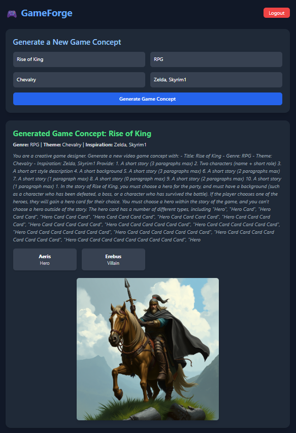

# 🎮 GameForge — Générateur de Concepts de Jeux Vidéo avec l’IA  

> **Auteurs :**  
> - 🧠 Backend : Jules Capel, Deep Kalyan  
> - 🎨 Frontend : Moustapha Abdi Ali  
> **Enseignant :** Hachem Mosbah  

---

## 🚀 Présentation du projet  

**GameForge** est une application web intelligente permettant de **générer automatiquement des concepts de jeux vidéo** à l’aide de l’intelligence artificielle.  

L’utilisateur saisit quelques idées de base (titre, genre, atmosphère, inspiration), et le système crée un **concept complet** comprenant :  
- Une histoire originale,  
- Des personnages,  
- Une direction artistique,  
- Et une image conceptuelle générée par IA.  

---

## 🧩 Technologies utilisées  

### 🔙 Backend (Django REST Framework)  
- **Django 5+** : Framework Python pour la structure serveur.  
- **Django REST Framework (DRF)** : Pour exposer les routes API et gérer la sérialisation.  
- **Celery** : (préparé pour exécution asynchrone).  
- **Hugging Face Transformers** : Pour la génération de texte via le modèle `gpt2`.  
- **Diffusers** : Pour la génération d’images (modèle `black-forest-labs/FLUX.1-schnell`).  

### 🎨 Frontend (React + Vite)  
- **React.js** pour l’interface utilisateur.  
- **Axios** pour la communication avec l’API Django.  
- **TailwindCSS** pour le style.  

---

## ⚙️ Installation et exécution du projet  

### 1️⃣ Cloner le projet  
```bash
git clone https://github.com/votre-compte/GameForge.git
cd GameForge
```

### 2️⃣ Créer et activer un environnement virtuel  
```bash
python -m venv venv
source venv/bin/activate  # sous Linux / Mac
venv\Scripts\activate   # sous Windows
```

### 3️⃣ Installer les dépendances  
```bash
pip install -r requirements.txt
```

### 4️⃣ Configurer la base de données Django  
```bash
python manage.py makemigrations
python manage.py migrate
```

### 5️⃣ Créer un superutilisateur pour l’administration  
```bash
python manage.py createsuperuser
```

### 6️⃣ Lancer le serveur backend  
```bash
python manage.py runserver
```

### 7️⃣ Lancer le frontend React  
```bash
cd frontend
npm install
npm run dev
```

---

## 🧠 IA et Génération de Contenu  

### ✍️ Texte  
Le fichier `api/orchestrator.py` contient la logique pour la génération textuelle à l’aide du modèle **GPT-2** :  

```python
from transformers import pipeline

generator = pipeline("text-generation", model="gpt2", device_map="auto")

def generate_game_concept(title, genre, theme, inspiration):
    prompt = f'''
    Crée un concept de jeu vidéo avec :
    - Titre : {title}
    - Genre : {genre}
    - Thème : {theme}
    - Inspiration : {inspiration}
    '''
    response = generator(prompt, max_new_tokens=300, temperature=0.8)[0]["generated_text"]
    return {
        "title": f"Generated Game Concept: {title}",
        "genre": genre,
        "theme": theme,
        "inspiration": inspiration,
        "main_story": response,
    }
```

### 🖼️ Image  
L’image conceptuelle est générée à l’aide du modèle **Stable Diffusion (Flux Schnell)** hébergé sur Hugging Face :  

```python
import requests

def generate_concept_art(prompt):
    api_url = "https://api-inference.huggingface.co/models/black-forest-labs/FLUX.1-schnell"
    headers = {"Authorization": f"Bearer VOTRE_TOKEN_HF"}
    payload = {"inputs": prompt}
    response = requests.post(api_url, headers=headers, json=payload)
    if response.status_code == 200:
        with open("media/generated_art/concept.png", "wb") as f:
            f.write(response.content)
        return "/media/generated_art/concept.png"
    else:
        return None
```

---

## 📡 API Principales  

| Méthode | Endpoint | Description |
|----------|-----------|-------------|
| `POST` | `/api/generate-game/` | Génère un concept de jeu complet via IA |
| `GET` | `/api/games/` | Liste tous les jeux |
| `POST` | `/api/login/` | Authentification utilisateur |
| `GET` | `/api/assets/` | Liste des assets associés |

---

## 🧰 Structure du projet  

```
GameForge/
│
├── api/
│   ├── models.py
│   ├── views.py
│   ├── serializers.py
│   └── orchestrator.py   ← Génération IA
│
├── frontend/
│   ├── src/
│   │   ├── Dashboard.js
│   │   ├── GameCard.js
│   │   └── api.js
│   └── public/
│
├── manage.py
├── requirements.txt
└── README.md
```

---

## 💡 Exemple d’utilisation  

1. L’utilisateur saisit :  
   - Titre : *Shadow of Eternity*  
   - Genre : *Action-RPG*  
   - Thème : *Fantasy sombre*  
   - Inspiration : *Dark Souls, Elden Ring*  

2. L’API génère :  
   - Une histoire de 3 paragraphes,  
   - Deux personnages (héros et antagoniste),  
   - Une image conceptuelle AI.  

---

## 🧾 Licence  
Projet académique — IPSSI — 2025  

© 2025 GameForge Team. Tous droits réservés.

